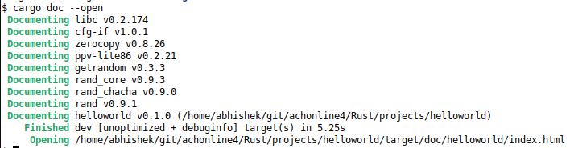
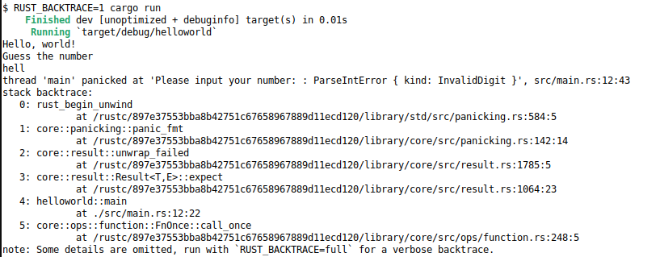
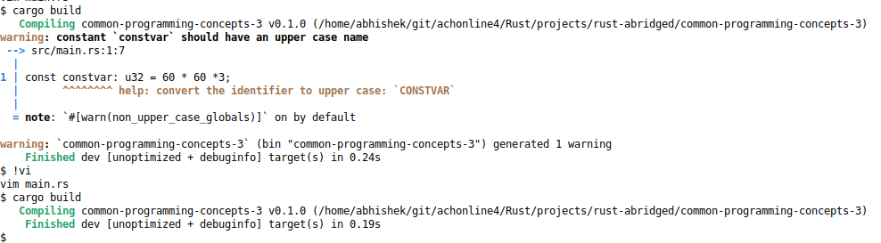
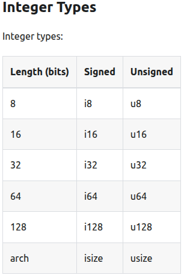
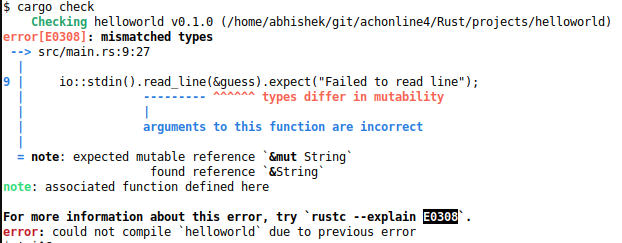
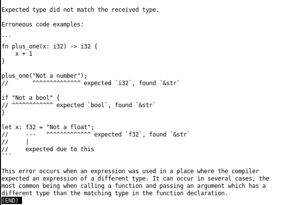

# Rust

##### References - Books / Links

| S.No | Reference                                                                                                    | Remarks                                                                                                                                 |
| ---- | ------------------------------------------------------------------------------------------------------------ | --------------------------------------------------------------------------------------------------------------------------------------- |
| 1.   | Rust book abridged  https://jasonwalton.ca/rust-book-abridged/https://jasonwalton.ca/rust-book-abridged/ | A condensed version of the original rust book - https://doc.rust-lang.org/stable/book/  Recommanded for experienced users only. |
|      |                                                                                                              |                                                                                                                                         |
|      |                                                                                                              |                                                                                                                                         |

##### Rust Dictionary

| S.No | Dictionary                                                                                 | Meaning                                                                                                                                                                                                                                                                                                                                                                                                                                                                                                 |
| ---- | ------------------------------------------------------------------------------------------ | ------------------------------------------------------------------------------------------------------------------------------------------------------------------------------------------------------------------------------------------------------------------------------------------------------------------------------------------------------------------------------------------------------------------------------------------------------------------------------------------------------- |
| 1.   | cargo new hello                                                                            | A command to create a new project (directory structure and hello world) called 'hello'.                                                                                                                                                                                                                                                                                                                                                                                                                 |
| 2.   | cargo build                                                                                | A command to build / compile the project and produce executables. It creates a directory called **target** when run for the first time in a project. You can also use the **rustc** command to compile your source code, like **rustc main.rs**.                                                                                                                                                                                                                                                        |
| 3.   | cargo run                                                                                  | A command to run executable.                                                                                                                                                                                                                                                                                                                                                                                                                                                                            |
| 4.   | cargo clean                                                                                | A command to clean all files generated by **cargo build** command. It deletes the **target** directory.                                                                                                                                                                                                                                                                                                                                                                                                 |
| 5.   | Cargo.lock                                                                                 | File used to maintain list of dependencies and their versions used in a project. Its generated by the **cargo build** command.                                                                                                                                                                                                                                                                                                                                                                      |
| 6.   | cargo check                                                                                | Command to verify that a project compiles without producing any executables.                                                                                                                                                                                                                                                                                                                                                                                                                            |
| 7.   | cargo build --release                                                                      | Command to produce release version of executables. By default cargo generates executables with debug information. Release executables are better optimized and don't have debug symbols or runtime safety checks.                                                                                                                                                                                                                                                                                       |
| 8.   | mut                                                                                        | A keyword which tells the compiler that the data can be modified. You can modify data either using the variable or a reference to that variable but in each case you need to tell the compiler explicitly about your intent of modifying it.  Eg: let mut guess;  // declare a modifiable variable named **guess**. read_line(&mut guess) // the same variable being passed to a function called **read_line** which is expected to modify the value using a reference to the variable. |
| 9.   | the prelude                                                                                | Its a set of symbols Rust automatically brings into scope from the standard library which get used in almost every program.                                                                                                                                                                                                                                                                                                                                                                             |
| 10.  | &                                                                                          | A reference. For eg: a reference to a variable is passed by prepending & to it.                                                                                                                                                                                                                                                                                                                                                                                                                         |
| 11.  | io::stdin()         .read_line(&mut guess)         .expect("Failed to read line"); | io - module that brings stdin symbol. read_line - function that reads a line from console. expect - error handling, in case read_line fails.                                                                                                                                                                                                                                                                                                                                                    |
| 12.  | println!("")                                                                               | A macro that writes to standard output, its similar to printf in C.                                                                                                                                                                                                                                                                                                                                                                                                                                     |
| 13.  | cargo add <CRATE>                                                                          | Add a new crate to your project. It's like bringing in an external library. For eg: cargo add rand The above commands add the **rand**, which is a random number generator to the current project.                                                                                                                                                                                                                                                                                              |
| 14.  | cargo update                                                                               | Update the lock file. Update all deps.                                                                                                                                                                                                                                                                                                                                                                                                                                                                  |
| 15.  | use rand::Rng; rand::rng().random_range(1..=100);                                      | rand - crate or external lib rng - a trait or an interface. We called the random_range method from the rng trait.                                                                                                                                                                                                                                                                                                                                                                               |
| 16.  | crate, trait, method                                                                       | crate - contains trait trait - contains method method - function                                                                                                                                                                                                                                                                                                                                                                                                                                |
| 17.  | Integer types                                                                              | default - signed                                                                                                                                                                                                                                                                                                                                                                                                                                                                                        |
| 18.  | Shadowing                                                                                  | Its a concept in Rust where a scope can have 2 variable of different types but same name. It basically allows the following -  1. Allow the variable to be modified without using **mut**  2. Change the type of the variable. You can change String to u32 by shadowing. 3. Basically allows a variable name to be used again instead of creating temp varible names to hold temp results. This is probably the better reason to have something like shadowing, IMO.                   |
| 19.  | Result                                                                                     | Its an ENUM with OK variant in case of success or ERR variant in case of failure. ENUMs in rust can carry extra information with them and not just a number.                                                                                                                                                                                                                                                                                                                                            |
| 20.  | cargo doc --open                                                                           | Generate HTML documentation for all the crates in your project and for your source code too.                                                                                                                                                                                                                                                                                                                                                                               |
| 21.  | cmp                                                                                        | A function in rust that takes a reference to a variable. It takes a reference and not value because of the following reasons - 1. ownership - cmp does need to own the variable, it just needs to read it otherwise the variable becomes invalid after cmp has read it unless the ownership is returned to the caller. 2. cmp can work on big types as well using references otherwise their values will need to be copied which is not a great idea.                                           |
| 22.  | RUST_BACKTRACE=full cargo run                                                              | In case of an error in the program due to which it might panic, you can print the backtrace using this command. RUST_BACKTRACE=1/full                                                                                                                                                                                                                                                                                                                                    |
| 23.  | match                                                                                      | its like a switch statement in C, match a given input to a list of items. `let guess: u32 = match guess.trim().parse() {             Ok(num) => num,             Err(_) => continue,         };`                                                                                                                                                                                                                                                                                        |
| 24.  | const or constants                                                                         | Its used to declare constants but rust compiler warns if the constants are not declared in BLOCK letters.  const CONSTVAR: u32 = 60 * 60 *3; Constants must always be annonated, Rust will not infer the type. const variables are stored in program binary and are hence immutable. Value of a const variable has to be something that can be evaluated at compile time.                                                                                    |
| 25.  | Variables                                                                                  | Variables cannot be declared at global scope unless they are static.                                                                                                                                                                                                                                                                                                                                                                                                                                    |
| 26.  | Size needed at compile time                                                                | Rust requires that all static and const variable sizes be known at compile time so that it can allocate memory accordingly. This code fails to compile -  `static HELLO_WORLD: str = "Hello, world!"` whereas this one doesn't -  `static HELLO_WORLD: &str = "Hello, world!"` that's because                                                                                                                                                                                       |
| 27.  | Data Types                                                                                 | Rust is a statically typed language. That means the size of the data type has to be known at compile time otherwise the compiler will throw error.                                                                                                                                                                                                                                                                                                                           |
| 28.  | static variables                                                                           | Can be mutable but we need unsafe code for that.                                                                                                                                                                                                                                                                                                                                                                                                                                                        |
| 29.  | Type Inference                                                                             | Although Rust is a statically typed language, which means that the size of a variable should be known at compile time, the following code works -  `let t = true;` That's because Rust also uses type inference, i.e. if a type is not specified explicitly Rust will use the value being assigned to the variable to **infer** the type of the variable, hence in this case **t** is **inferred as bool** and it cannot be assigned any other type of value.                                   |

##### rustc - rust cool or rust compiler :)

Rust compiler enumerates every single error it throws and you can find more details about those using the compiler itself.
Following is a snapshot of error mismatched types and the second last line tells you how you can find more details about it.

And following is what that explanation looks like - 

Random

Mutability

    `let var;
    var =  10;`

    This is an assignment, therefore the compiler allows the variable to be modified, but
    only one time.

Scope

    use std::io; io::stdin()

    std::io::stdon()

    Both of the above ways are identical in Rust, they have no difference when it comes
    to binary size or any other build aspect.
    Unlike in C++, where using a namespace brings all its symbols into scope which
    essentially increases the binary size regardless if all the symbols are being used or
    not.
